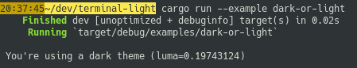
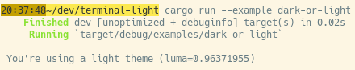

[![MIT][s2]][l2] [![Latest Version][s1]][l1] [![docs][s3]][l3] [![Chat on Miaou][s4]][l4]

[s1]: https://img.shields.io/crates/v/terminal-light.svg
[l1]: https://crates.io/crates/terminal-light

[s2]: https://img.shields.io/badge/license-MIT-blue.svg
[l2]: LICENSE

[s3]: https://docs.rs/terminal-light/badge.svg
[l3]: https://docs.rs/terminal-light/

[s4]: https://miaou.dystroy.org/static/shields/room.svg
[l4]: https://miaou.dystroy.org/3

# terminal-light

This crate answers the question *"Is the terminal dark or light?"*.

It provides

* the background color, either as RGB or ANSI
* the background color's luma, which varies from 0 (black) to 1 (white)

A use case in a TUI is to determine what set of colors would be most suitable depending on the terminal's background:

```
let should_use_light_skin = terminal_light::luma()
    .map_or(false, |luma| luma > 0.6);
```

If you have very specialized skins, you may choose a more precise switch:

```
match terminal_light::luma() {
    Ok(luma) if luma > 0.85 => {
        // Use a "light mode" skin.
    }
    Ok(luma) if luma < 0.2 => {
        // Use a "dark mode" skin.
    }
    _ => {
        // Either we couldn't determine the mode or it's kind of medium.
        // We should use an itermediate skin, or one defining the background.
    }
}
```

See the included example:






# Strategies

Here are the various strategies automatically used by terminal-light to answer the big question:

## `$COLORFGBG` strategy

This environment variable is set by some terminals, like konsole or the rxvt family.
It can also be set by users.
Its value is like `15;0` where the second number is the ANSI code for the background color.

Upsides:

* querying an env variable is a fast operation

Downsides:

* this env variable isn't always immediately updated when you change the color of the terminal
* the value isn't precise: `0` is "dark" and `15` is "light" but the real RGB color is uncertain as the low ANSI codes are often modified by the user

## "Dynamic colors" OSC escape sequence strategy

Modern terminals implement this xterm extension: a query making it possible to know the background color as RGB.

Terminal-light sends the query on `stdout`, waits for the answer on `stdin` with a timeout of 20ms, then parses this answer.

Upsides:

* this works well on all tested unix terminals, including on MacOs
* the value is precise (RGB)
* the value is up to date when it's available

Downsides:

* waiting for stdin with a timeout isn't implemented on Windows in this crate (help welcome)
* this isn't instant, a delay of 10 ms to get the answer isn't unusual
* if a not compatible terminal doesn't answer at all, we're waiting for 20ms
* it may fail on some terminal multiplexers

## Global strategy used by Terminal-light

1. if we're on a unix-like platform, we try the escape sequence strategy
2. if it failed or we're not on unix, we try the `$COLORFGBG` strategy
3. without a solution, we return a `TlError::Unsupported` error
